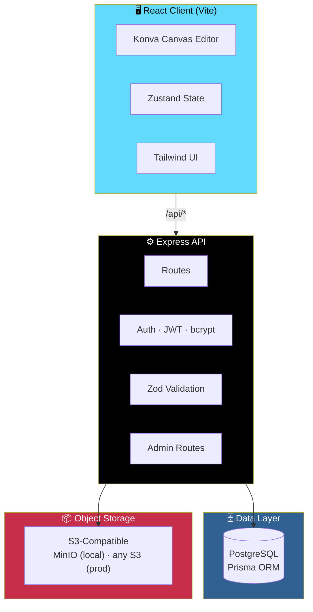

# 👕 MerchStudio

<div align="center">


**A browser-based merchandise design studio.**

*Pick a product. Customize it with text, images, and shapes. Export print-ready artwork.*

[✨ Features](#-whats-implemented) • [🏗️ Architecture](#-architecture) • [🚀 Running Locally](#-running-locally) • [🛍️ Admin](#-admin-dashboard) • [🗺️ Roadmap](#-where-to-take-this-next)

</div>

---

> ⚠️ **This is a full-stack scaffold.**
>
> The pieces run end-to-end — auth, database, uploads, a working Konva-based editor — but it's a **starting point, not a finished commercial product**. See [Where to Take This Next](#-where-to-take-this-next) below for honest scope notes.

---

## 📖 Overview

**MerchStudio** lets users design custom merchandise directly in the browser. Choose a product — T-shirt, hoodie, tote, cap, sweatshirt, or mug — then customize it with text, images, and shapes, and export print-ready artwork.

### Core Idea

> **A working editor, a real backend, an honest scaffold.**
>
> Everything runs. Nothing is faked. But it's a foundation, not a finished product.

---

## ✨ What's Implemented

<div align="center">

| 🔐 Full Auth Flow | 🛍️ Product Catalog |
|:---:|:---:|
| Register · login · refresh · logout — bcrypt + JWT access/refresh tokens | Products with color variants, ready for real mockups |
| **🎨 Working Canvas Editor** | **🖼️ Image Uploads** |
| Konva-powered: text, shapes, images — drag, resize, rotate | S3-compatible storage with MIME/size validation |
| **📐 Layers Panel** | **↩️ Undo / Redo** |
| Show/hide · lock · reorder — real layer management | Full history with a contextual property panel |
| **💾 Design CRUD** | **🎁 Brand Kit** |
| Create · autosave · rename · favorite · duplicate for variations · delete | Store logo, colors, and font for reuse across designs |
| **🔗 Shareable Links** | **📤 Client-Side Export** |
| Read-only design share pages | PNG / JPG export from the canvas |
| **🛡️ Server Hardening** | **👑 Admin Dashboard** |
| Rate limiting · Zod validation · CORS · admin-only routes | Products · templates · graphics · stats · user list |

</div>

### Detailed Feature List

- **Authentication** — register / login / refresh / logout with hashed passwords and JWTs
- **Product catalog** with color variants
- **Design CRUD** — create, autosave, rename, favorite, duplicate (for variations), delete
- **A working canvas editor** (Konva):
  - Add text, shapes, and images
  - Drag / resize / rotate
  - Layers panel with show/hide, lock, and reorder
  - Undo / redo history
  - Contextual property panel
- **Image uploads** to S3-compatible storage with MIME/size validation
- **Brand kit** — logo, colors, font storage
- **Shareable read-only design links**
- **Client-side PNG / JPG export** from the canvas
- **Server hardening** — rate limiting, Zod input validation, CORS
- **Admin-only route group** for products, templates, graphics, and stats
- **Admin dashboard UI** at `/admin` — visible in the nav to `ADMIN`-role users

---

## 🏗️ Architecture

### System Diagram



### Project Structure

```
merchstudio/
├── client/          React app (Vite)
├── server/          Express API
├── prisma/          Shared Prisma schema + seed script
├── docker-compose.yml
└── .env.example
```

### Tech Stack

| Layer | Technology |
|-------|-----------|
| **Client** | React · TypeScript · Vite · Tailwind CSS · Zustand · Konva (`react-konva`) |
| **Server** | Node.js · Express · TypeScript · Prisma · PostgreSQL |
| **Storage** | S3-compatible object storage — **MinIO** locally, any S3 provider in production |
| **Auth** | Email/password with **bcrypt** hashing and **JWT** access + refresh tokens |

---

## 🚀 Running Locally

### 1. Start Postgres and MinIO

```bash
docker compose up postgres minio -d
```

### 2. Set Up the Server

```bash
cd server
cp .env.example .env    # adjust secrets as needed
npm install
npm run prisma:generate
npm run prisma:migrate   # creates tables
npm run prisma:seed      # seeds products, templates, graphics, and an admin user
npm run dev               # http://localhost:4000
```

> 🔑 **Seeded admin login:** `admin@merchstudio.dev` / `password123`
>
> ⚠️ **Change this before deploying anywhere real.**

### 3. Set Up the Client

```bash
cd client
npm install
npm run dev               # http://localhost:5173, proxies /api to the server
```

### 4. Or — Run Everything in Docker

```bash
docker compose up --build
```

---

## 👑 Admin Dashboard

The admin dashboard lives at **`/admin`** and is **visible in the nav to `ADMIN`-role users**.

### What's Inside

| Section | Capabilities |
|---------|-------------|
| **Statistics** | Platform-wide usage overview |
| **Products** | Product & color-variant management |
| **Templates** | Template management with premium / enable toggles |
| **Graphics Library** | Graphics library manager |
| **Users** | User list with plan and role |

Admin routes are protected by an **admin-only route group** on the server — the UI visibility is convenience, not security.

---

## 🔧 Environment Variables

See:

- **`.env.example`** (root)
- **`server/.env.example`**

### Required

| Variable | Purpose |
|----------|---------|
| `DATABASE_URL` | PostgreSQL connection string |
| `JWT_SECRET` | Access token signing secret |
| `JWT_REFRESH_SECRET` | Refresh token signing secret |
| `S3_*` | S3-compatible credentials (endpoint, key, secret, bucket) |

### Optional

Everything else has a **sane default for local development**.

---

## 🗺️ Where to Take This Next

This scaffold **intentionally leaves some things simplified** so the whole flow actually runs. Here's the honest state of each.

### 📤 Export — Currently Client-Side

**Current:** Export happens client-side from the canvas (`toDataURL`).

**Why this is a limitation:**

- "Transparent PNG" and "High Resolution" options can't be truly honored
- Exports require the editor to be open
- No server-side batch or programmatic export

**What a production version should do:**

- Render exports **server-side** — e.g. with `sharp` or a headless renderer
- Make "Transparent PNG" and "High Resolution" genuinely real
- Allow exports to be generated **without the editor open**

### 💳 Billing — Fields Exist, Integration Doesn't

**Current:**

- Plan fields on `Subscription` (Free / Pro / Business)
- Free-tier design limit is enforced

**Missing:**

- No Stripe (or other payment processor) integration yet

**What's next:** Wire up Stripe Checkout + webhooks, mirroring the pattern used in PosterMaker API — *plan tier changes only on webhook confirmation*.

### 🖼️ Background Removal — Not Implemented

**Current:** Mentioned in the spec as *"where technically practical"* — no implementation included.

**What's next:** Would call an external image API (e.g. remove.bg, or a self-hosted model).

### 📊 Analytics — Not Built

**Current:** Nothing for Business accounts yet.

**What's available:** `DesignVersion` rows give you an **export / edit trail** to build charts from — the data model is already there.

### 🖼️ Product Mockups — Not Bundled

**Current:** Mockups are referenced by URL (`frontImage` / `backImage` on `ProductVariant`) but **no real photography or mockups are bundled**.

**What's next:** Swap in real assets before shipping.

---

## 🛠️ Tech Stack (Detailed)

### Client

| Tool | Role |
|------|------|
| **React** | UI framework |
| **TypeScript** | Type safety |
| **Vite** | Build tool & dev server |
| **Tailwind CSS** | Styling |
| **Zustand** | State management |
| **Konva / react-konva** | Canvas editor |

### Server

| Tool | Role |
|------|------|
| **Node.js** | Runtime |
| **Express** | HTTP framework |
| **TypeScript** | Type safety |
| **Prisma** | ORM |
| **PostgreSQL** | Database |
| **bcrypt** | Password hashing |
| **JWT** | Access + refresh tokens |
| **Zod** | Request validation |

### Infrastructure

| Tool | Role |
|------|------|
| **MinIO** | S3-compatible local storage |
| **Docker Compose** | Local orchestration |

---

## 🗺️ Roadmap

### ✅ Current

- [x] Register / login / refresh / logout with hashed passwords and JWTs
- [x] Product catalog with color variants
- [x] Design CRUD (create, autosave, rename, favorite, duplicate, delete)
- [x] Working Konva canvas editor with text, shapes, and images
- [x] Layers panel with show/hide, lock, and reorder
- [x] Undo / redo history
- [x] Contextual property panel
- [x] Image uploads to S3-compatible storage
- [x] Brand kit storage
- [x] Shareable read-only design links
- [x] Client-side PNG / JPG export
- [x] Rate limiting, Zod validation, CORS
- [x] Admin-only route group + admin dashboard UI

### 🔜 Future Ideas

- [ ] **Server-side export** — `sharp` or headless renderer for transparent & high-res
- [ ] **Stripe billing** integration (Free / Pro / Business)
- [ ] **Background removal** via external image API
- [ ] **Analytics dashboards** for Business accounts
- [ ] **Real product mockups** — photography / 3D renders
- [ ] **Team collaboration** — shared workspaces
- [ ] **Template marketplace** — user-submitted designs
- [ ] **Print-on-demand integration** — direct order fulfillment
- [ ] **Design versioning UI** — browse and restore historical versions

---

## 🤝 Contributing

Contributions are welcome. Please:

1. Fork the repository
2. Follow the existing client / server split
3. Validate every request with Zod on the server
4. Keep the admin boundary server-side, not just hidden in the UI
5. Submit a Pull Request

### Guidelines

- **Never trust the client** for auth, ownership, or admin status
- **Validate every upload** — MIME type and size
- **Keep the editor responsive** — heavy work belongs on the server
- **Preserve the honest scope** — don't pretend a feature is done when it isn't

---

## 📜 License

MIT — see [LICENSE](LICENSE) for details.

---

## 🙏 Acknowledgments

- **Konva** — for making a canvas editor feel native
- **Prisma** — for making PostgreSQL a joy
- **MinIO** — for S3 locally, without the cloud
- **Every designer who's ever wished the editor were simpler** — this is for you

---

<div align="center">

### 👕 DESIGN. CUSTOMIZE. EXPORT.

**A working editor. A real backend. An honest scaffold.**

<br>

⭐ If this project helped you, consider giving it a star.

<br>

[⬆ Back to Top](#-merchstudio)

</div>
